# Voxel Usage for Polygon Modification and Deformation

Voxel Based approach for deformation and modification of polygon models.
Tested on 4GB VRAM, less would be quiet difficult. Also NVIDIA Graphic Card needed.
</br>

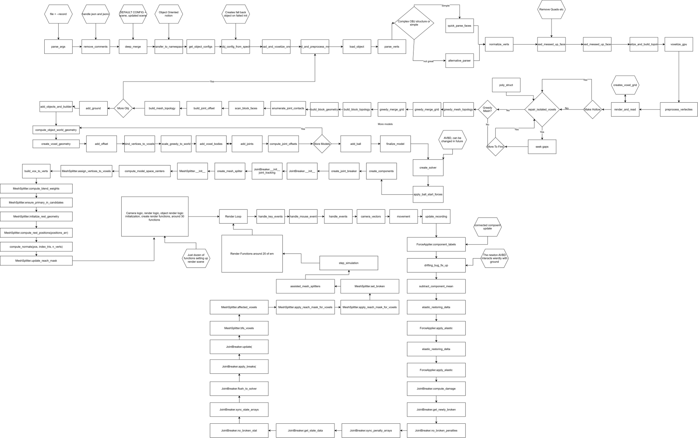

<a href="https://youtu.be/RO1Zv-oruCY">
  
</a>
</br>

How to run

```
python main.py [scene_name]
```

If you want to make a video of simulation append

```
python main.py [scene] --record [file.mp4]
```

or

```
make run
```

In scene commands:

# Press C for Run

# Press V for Voxels

# WASDQR for Movment

# Mouse for Rotation

## Development Screenshots

### Version 1

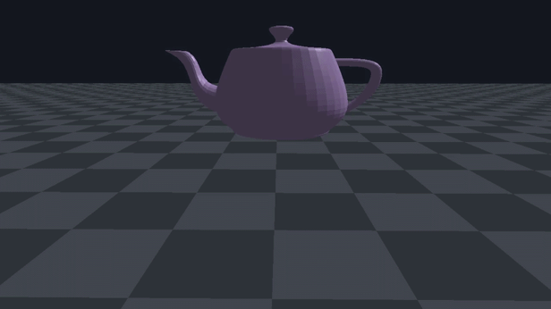

### Version 0.4

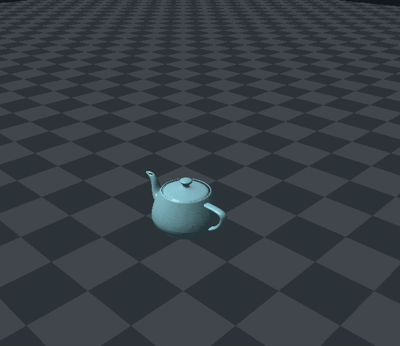

### Version 0.3

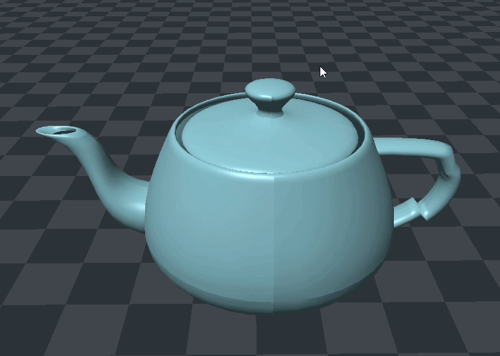

### Version 0.2

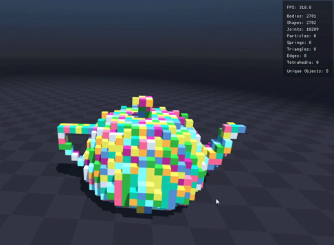

### Version 0.1


## Screenshots

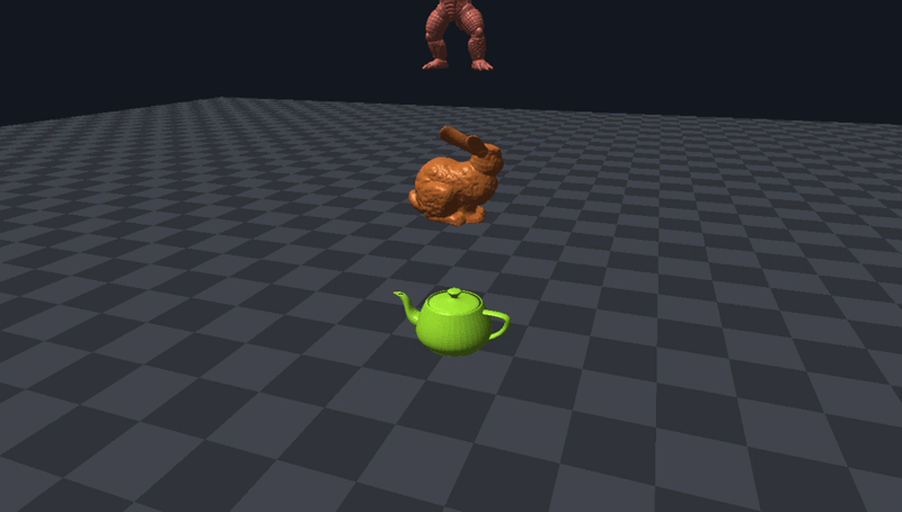
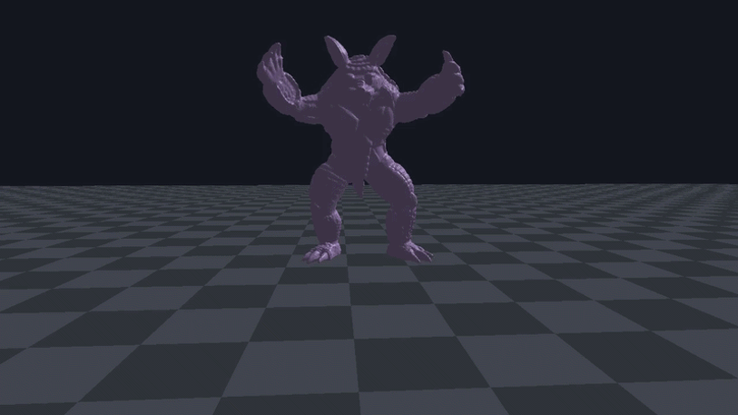
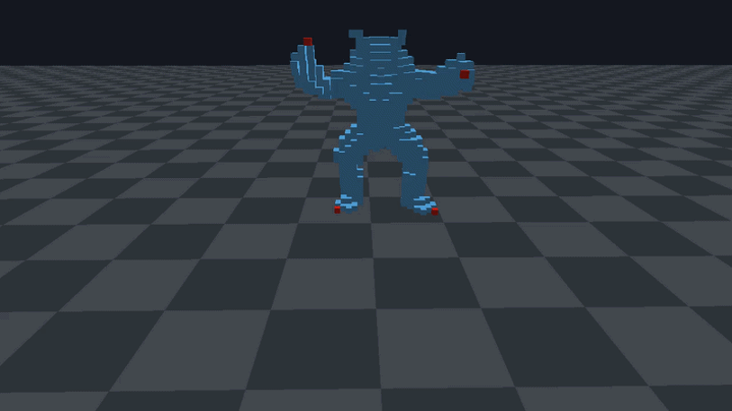
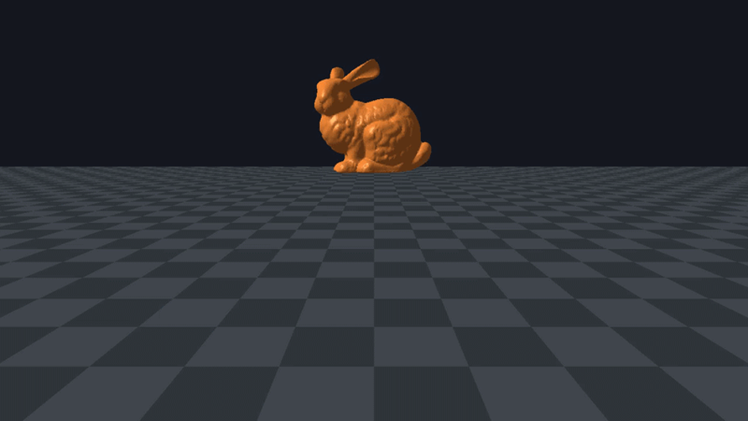
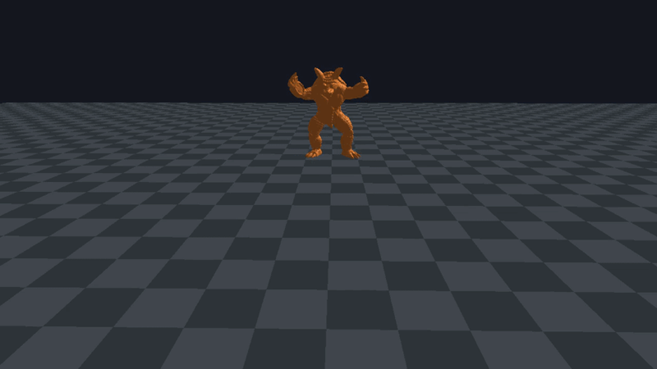
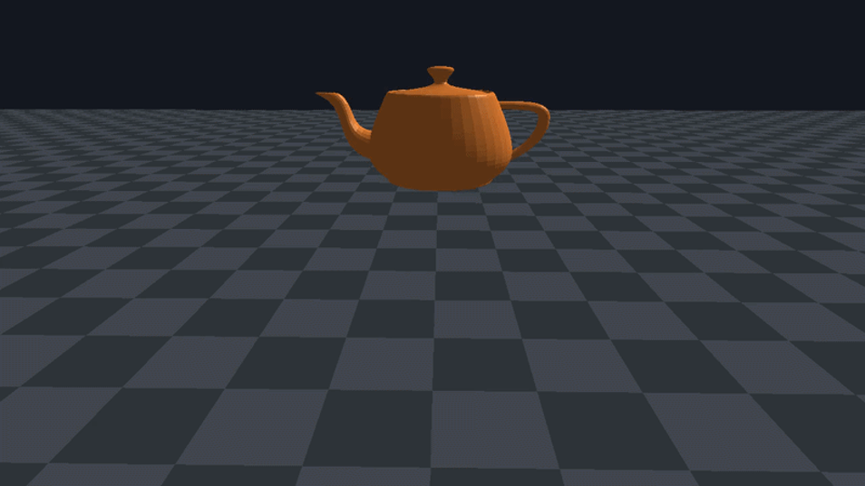
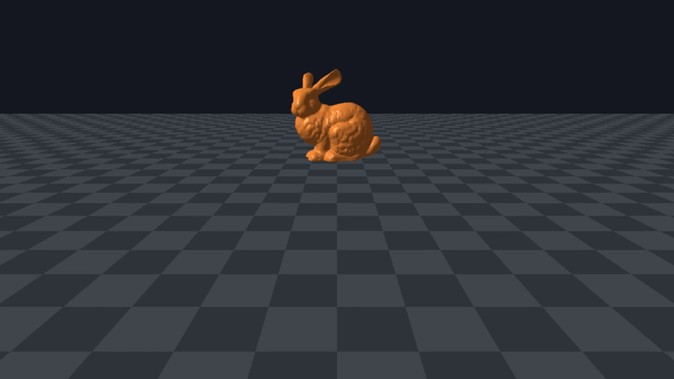
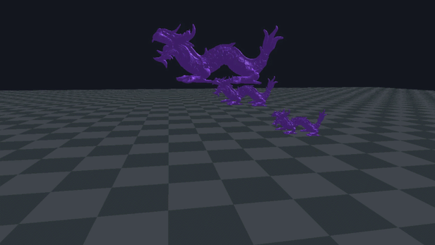
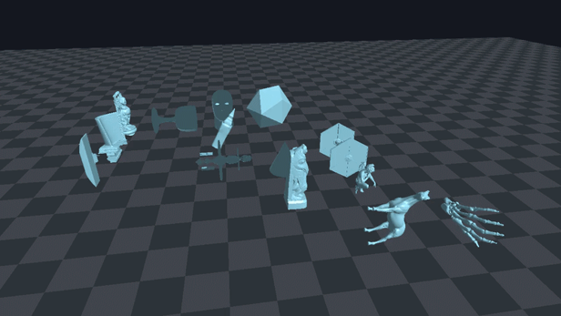
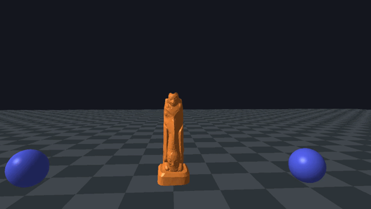
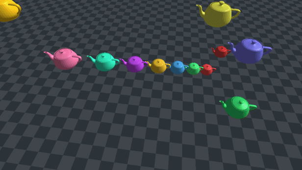
